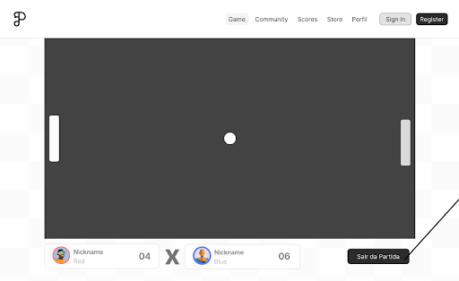

# 🏓 Resumo

Aplicação de Microsserviços e Sistemas Distribuídos através do desenvolvimento do jogo Pong Multiplayer.

O projeto propõe o desenvolvimento de uma versão moderna do clássico jogo Pong, adaptado para partidas e torneios multijogador online em tempo real em navegadores web. Construído com uma arquitetura de microsserviços, o sistema explora tecnologias como Python (Django), C# (.NET), JavaScript, Typescript, Next.js, Docker, PostgreSQL, e Redis, promovendo escalabilidade e manutenção.

O principal desafio deste projeto é garantir uma comunicação síncrona eficiente durante as ações dos jogadores, assegurando baixa latência e resposta em tempo real. Além disso, a arquitetura do sistema deve ser projetada para suportar uma alta carga de usuários simultâneos, garantindo escalabilidade e estabilidade mesmo em momentos de pico.

O projeto também conta com pipeline de integração continua (CI) e deploy continuo (CD), atráves de ferramentas de automoção do github actions, além alta adaptação aos ambiente já que o projeto está sendo containizado e orquestratodo com docker compose.

